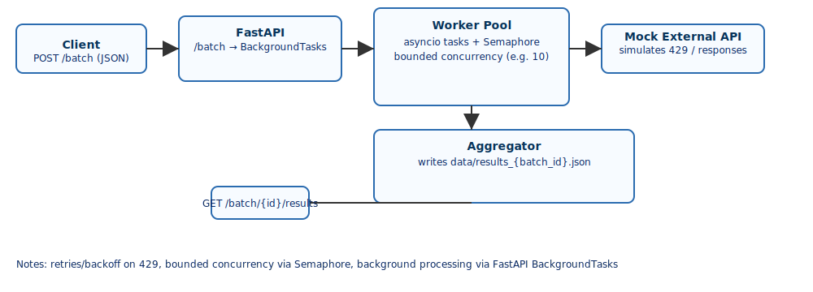

# AI Prompt Batch Processing Service

Summary
- Minimal FastAPI service that accepts a JSON array of prompts, processes them concurrently against a mock rate-limited inference endpoint, and writes aggregated results to JSON files under `data/`.

Quickstart (minimal)
1. Create and activate a virtual environment and install dependencies:

```bash
python -m venv .venv
source .venv/bin/activate
.venv/bin/pip install -r requirements.txt
```

2. Start the server (from project root):

```bash
.venv/bin/python -m uvicorn app.main:app --reload --port 8000
```

3. Submit a batch (example):

```bash
.venv/bin/curl -s -X POST "http://127.0.0.1:8000/batch" -H "Content-Type: application/json" -d '["hello","world"]'
```

Design
- Concurrency: `process_batch` launches asyncio tasks for each prompt but uses an `asyncio.Semaphore` to limit concurrent outbound calls (default `concurrency=10`). To change concurrency, either modify the default in `app/worker.py` or pass a different value where `process_batch` is scheduled, e.g. `background.add_task(process_batch, batch_id, prompts, 20)`.
- Retry/backoff: `call_with_retries` implements exponential backoff on HTTP 429 responses.
- Aggregation: Completed results are written to `data/results_{batch_id}.json` and progress to `data/progress_{batch_id}.json`.

Architecture Diagram
- See `docs/diagram.svg` (embedded below).



API examples
- Submit batch (202 Accepted):

```json
{ "batch_id": "<uuid>", "status": "accepted" }
```

- Status (200 OK):

```json
{ "batch_id": "<uuid>", "total": 1000, "completed": 400 }
```

- Results (200 OK):

```json
{ "batch_id": "<uuid>", "results": [ {"prompt":"...","result":{...}}, ... ] }
```

Testing
- Unit tests: run `.venv/bin/python -m pytest -q`.
- Local E2E: start the server and use the `/batch`, `/batch/{id}/status` and `/batch/{id}/results` endpoints as shown above.

Troubleshooting
- Port already in use: change `--port` or kill the process using the port (`lsof -i:8000`).
- `uvicorn` missing: install it in the venv with `.venv/bin/pip install uvicorn`.
- Python 3.14 httpx/httpcore issues: some test helpers (Starlette/FastAPI TestClient) import `httpx`/`httpcore` which may be incompatible with Python 3.14; if tests fail, either upgrade `httpx`/`httpcore` (`.venv/bin/pip install -U httpx httpcore`) or run tests under Python 3.11/3.12.

CI
- `.github/workflows/ci.yml` runs the unit tests on push/PR.

Notes and next steps
- Consider replacing JSON file persistence with SQLite for atomic updates and easier status queries.
- Add graceful shutdown handling if you rely on background tasks for progress durability.
